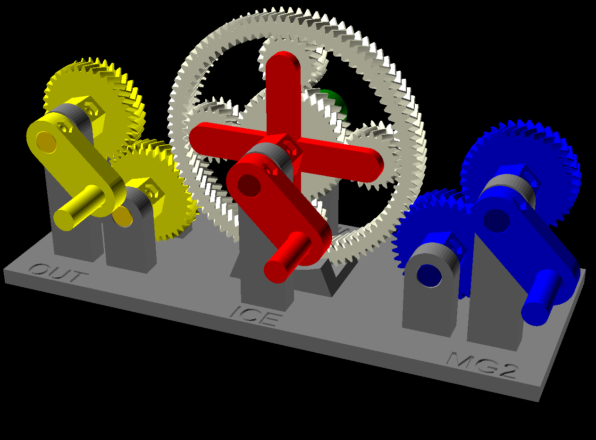

# Electronic Continuously Variable Transmission (E-CVT) model

Simplified model of the E-CVT used by Toyota and Ford in their hybrid vehicles, e.g. the Toyota Prius. This transmission uses electric motors to achieve an infinite amount of gear ratios.

Check out the [Printables page](https://www.printables.com/model/1576513) for more info.

